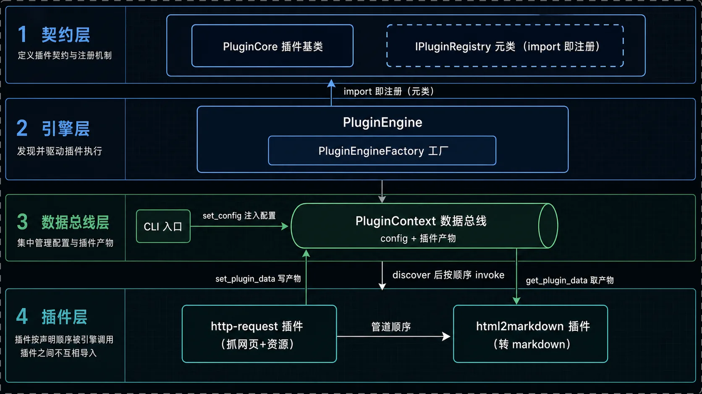
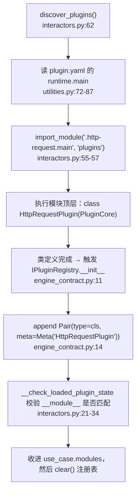
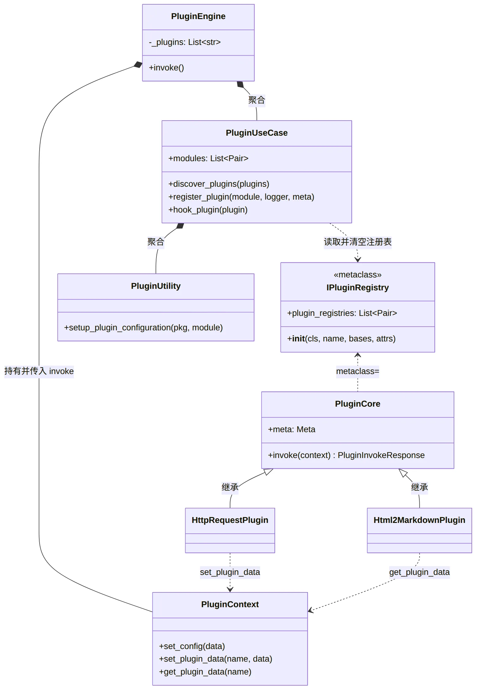
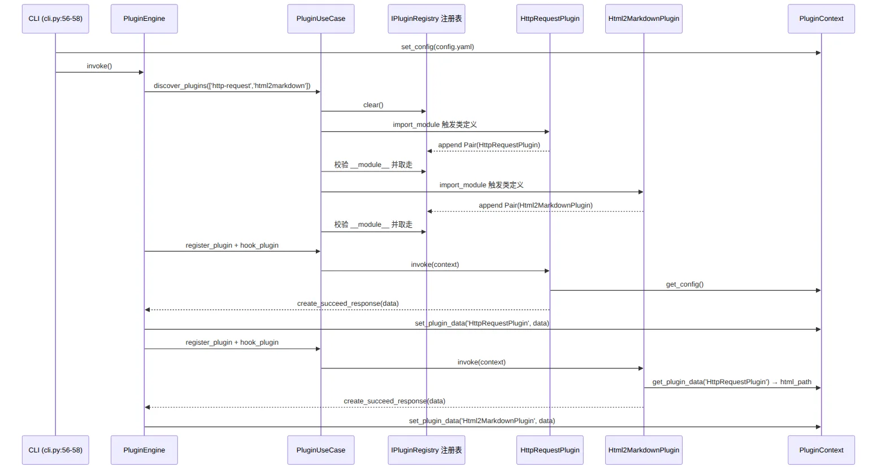
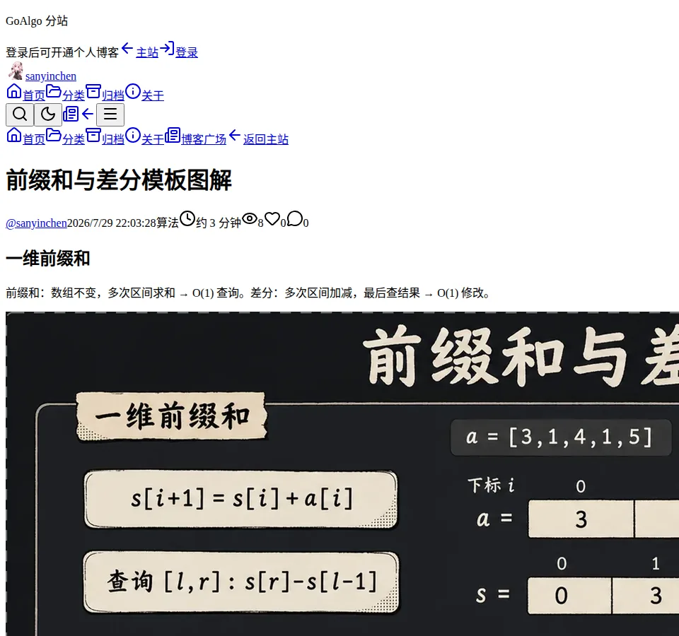
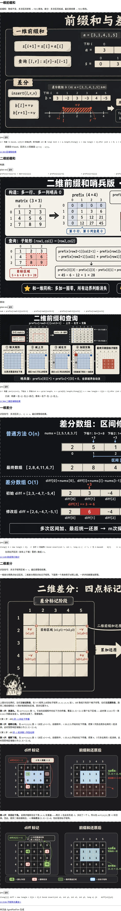

# import 即注册：pyplugin-framework 是怎么把两个插件串成管道的

一条命令：

```bash
python bin/html2markdown/html2markdown-cli.py
```

二十秒后输出：

```text
页面标题  : 前缀和与差分模板图解 - sanyinchen - GoAlgo
渲染方式  : 无头浏览器
资源      : 成功 151 个，失败 0 个
markdown  : .../前缀和与差分模板图解.md
正文规模  : 3882 字符 / 6 个代码块 / 7 张图
```

一个前端渲染的博客页面被抓成离线副本，再被转成 markdown。干活的是 `plugins/http-request/` 和 `plugins/html2markdown/` 两个插件，它们之间**一行 import 都没有**。

全文只回答一个问题：**这两个互不相识的插件，是怎么被框架编排成一条管道的？**

结论先给：元类自动注册 + `PluginCore` 统一契约 + `PluginContext` 数据总线。三者分别解决「引擎怎么知道有你」「引擎怎么调你」「你怎么把产物给下一个人」。核心代码 341 行——`engine/` 92 行（`engine_contract.py` 37 + `engine_core.py` 55）、`usecase/` 174 行（`interactors.py` 83 + `utilities.py` 91）、`model/models.py` 75 行。Python 3.12，仓库当前唯一提交 `449a397`。



读图顺序：CLI 把配置写进 `PluginContext`（数据总线）→ 引擎 discover 触发元类「import 即注册」→ 按声明顺序逐个 invoke 插件 → 每个插件的产物也写回总线 → 后一个插件从总线取前一个的产物。上面是模块视图，先有个印象，下面逐层拆。

```
engine/    契约与驱动：PluginCore、IPluginRegistry、PluginEngine、PluginEngineFactory
usecase/   发现与装配：PluginUseCase（discover/register/hook）、PluginUtility（读 plugin.yaml）
model/     数据契约：PluginContext（总线）、PluginInvokeResponse、Meta、Pair
plugins/   业务：http-request（网页离线化）、html2markdown（html → md）
bin/       demo 入口 CLI + config.yaml
```

## 一、元类：类定义完成的那一瞬间就注册了

插件框架绕不开的第一问：引擎从哪知道有哪些插件？手动登记表、扫目录、entry points，这个框架都没选，它用了元类——元类就是「造类的类」，类语句执行完会调用它的 `__init__`。看 `engine/engine_contract.py:8-14`：

```python
class IPluginRegistry(type):
    plugin_registries: List[Pair] = list()

    def __init__(cls, name, bases, attrs):
        super().__init__(cls)
        if name != 'PluginCore':
            IPluginRegistry.plugin_registries.append(Pair(type=cls, meta=Meta(name)))
```

`PluginCore` 声明了 `metaclass=IPluginRegistry`（`engine_contract.py:17`），于是任何继承它的子类，在**类定义完成的瞬间**就把自己 append 进全局注册表。插件模块被 import，注册就发生了，引擎一行登记代码都不用写。`if name != 'PluginCore'` 挡住基类自己入表。

这是全框架最聪明的一处：把「注册」这个动作从运行时挪到了导入时，代价只有 7 行。



注意 `import_module` 用的是字符串。目录名 `http-request` 带连字符，不是合法 Python 标识符，`import http-request` 直接语法报错；走字符串导入毫无问题。插件名只承担「目录名 + 总线里的 key」，不承担模块标识符的职责——这是有意的取舍。

`__check_loaded_plugin_state` 的校验很取巧：拿注册表**最后一个** `Pair` 的 `type.__module__` 跟刚 import 的模块名比对，对上就收下，然后清空注册表。所以一个模块里定义多个 `PluginCore` 子类，只有最后一个生效。这是坑，不是特性。

## 二、契约与驱动：两阶段，顺序由调用方声明

`PluginEngine.invoke()` 只有两行（`engine_core.py:25-29`）：先 `__install_plugins`（发现），再 `__invoke_on_plugins`（执行）。为什么要拆？因为执行顺序必须由**调用方声明**，不能由发现顺序或文件系统顺序决定。声明写在工厂里（`engine_core.py:51-55`）：

```python
@staticmethod
def create_html2markdown_engine() -> PluginEngine:
    return PluginEngine(common_plugins=['http-request', 'html2markdown'])
```

这个列表就是拓扑序。执行阶段严格按它遍历（`engine_core.py:38-48`）：

```python
for module in self.use_case.modules:
    plugin = self.use_case.register_plugin(module.type, self._logger, module.meta)
    res = self.use_case.hook_plugin(plugin)(self._context)
    if res.is_succeed():
        self._context.set_plugin_data(module.meta.name, res.data)
```

`register_plugin` 就是 `module(logger, meta)` 实例化，`hook_plugin` 就是返回 `plugin.invoke`，两个都是薄封装。真正的状态变化在最后一行：**插件唯一的对外输出，是往 context 里写的那一笔数据**，key 是 `module.meta.name`，也就是插件类名。



读图要点：`PluginCore` 是唯一基类，两个插件都继承它；`IPluginRegistry` 是它的元类；`PluginEngine` 聚合 `PluginUseCase` 和 `PluginContext`；`PluginUseCase` 读且清空注册表。

## 三、数据总线：类名即 key

插件 A 的产物怎么给插件 B？只有一条路——`PluginContext`（`model/models.py:10-25`），三个方法：`set_config`、`set_plugin_data`、`get_plugin_data`。

`http-request` 的产物落在 `context.data['HttpRequestPlugin']`。下游消费它的代码只有一行（`plugins/html2markdown/main.py:108`）：

```python
upstream = context.get_plugin_data('HttpRequestPlugin') or {}
```

拿到 `html_path`，往下 BeautifulSoup 命中 `article .markdown-body`、剥掉 script/nav/评论、markdownify 转 md。整个跨插件耦合就是这个字符串。



真实日志能对上这个时序：`HttpRequestPlugin invoke succeed` 出现在 `Html2MarkdownPlugin invoke succeed` 之前，中间夹着 `article content matched by: article .markdown-body`。

配置注入发生在 `invoke()` **之前**，而 discover 是 `invoke()` 内的第一步——所以插件被加载时配置已经在总线上了。加载不读配置，执行时才取，这个先后关系把「加载」和「配置」解耦得很干净。

## 四、效果

产物一套：`raw.html`、改写了资源引用的 `index.html`、`meta.json`（151 个资源的 url → 本地映射）、`assets/`、最后是 markdown。



生成的 markdown 片段：

````markdown
---
title: "前缀和与差分模板图解"
source: "https://algo.zhiyuansofts.cn/blog/sanyinchen/t4omlybe8j"
---

## 一维前缀和


```java
// 构建（1-based，s[0]=0 处理边界；和可能爆 int 换 long）
long[] s = new long[n + 1];
for (int i = 0; i < n; i++) {
    s[i + 1] = s[i] + a[i];
}
```
````

图片指向本地 `assets/`，代码块带上了 `java` 标注，标题里的站点后缀被剥掉。



## 五、三个必须知道的坑

**类属性共享**。`PluginContext.data` 和 `PluginInvokeResponse.data` 都是类属性（`models.py:11`、`models.py:60`），所有实例共享同一份 dict。单引擎无感，同时起两个引擎实例就会串数据。`create_succeed_response` 里 `res.data = data` 是实例级赋值恰好盖住了共享值，所以更隐蔽。多引擎部署前必须改成实例属性。

**类名即 key**。重构类名会静默断掉下游 `get_plugin_data`，没有编译期报错，只有运行时 `None`。key 应该从 `plugin.yaml` 声明，而不是从类名推导。

**只认最后一个子类**，前面说过了。

省掉的东西也很鲜明：没有插件间依赖、没有事件系统、没有动态卸载。插件就是管道上一个节点，进 context、出 context，代价是插件感知不到「谁在我前面」。

## 六、验证入口

回到开头那个问题：两个插件不互相 import 也能串成管道，是因为**元类让它们 import 即注册，`PluginCore` 让引擎能用同一种方式驱动它们，`PluginContext` 让它们只通过一个字符串 key 交换产物**。顺序则完全由工厂里那个列表决定。

想亲手证明「顺序即管道」，把 `create_html2markdown_engine`（`engine_core.py:54`）里两个插件名互换再跑：

```bash
python bin/html2markdown/html2markdown-cli.py
```

会看到 `Html2MarkdownPlugin` 先执行，因为拿不到 `HttpRequestPlugin` 的产物而返回 `html_path is empty`——管道干净地断在缺数据那一步，不崩，只失败。这就是这套框架对管道正确性最直白的表达。

---

本文由 AgentPlanFlow 生成
